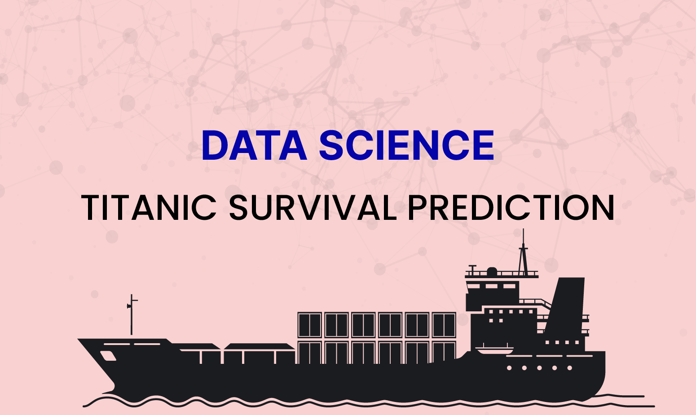

# Titanic Survival Prediction

## Project Overview

The Titanic Survival Prediction project is designed to analyze and predict the survival chances of passengers on the Titanic. By examining various factors such as socio-economic status, age, and gender, the project aims to identify the key determinants of survival during the tragic event. Using machine learning techniques, this system provides insights and predictions based on historical data from the Titanic passenger list.

## Project Workflow

  - Data Exploration: Initial exploration of the dataset to understand its structure and identify key features.
  - Data Preprocessing: Cleaning the data, handling missing values, and encoding categorical variables.
  - Feature Engineering: Creating new features that may help improve the model's performance.
  - Model Training: Training various machine learning models to predict passenger survival.
  - Model Evaluation: Evaluating the performance of the models using appropriate metrics.
  - Insights and Visualization: Generating visualizations to present the findings and key insights from the analysis.

## Results

The project results includes a trained model that predicts passenger survival with reasonable accuracy. Additionally, the analysis will highlight the most significant factors influencing survival, providing valuable historical insights.

## Contributing

Contributions to the Titanic Survival Prediction project are welcome. Feel free to open issues or submit pull requests with improvements or new features.

## License

This project is licensed under the MIT License.

## Acknowledgments

- The dataset used in this project is provided by Kaggle.
- Inspiration and guidance from various Titanic analysis projects and machine learning tutorials.
- This project is a part of the tasks provided by the internship at CodeAlpha.
